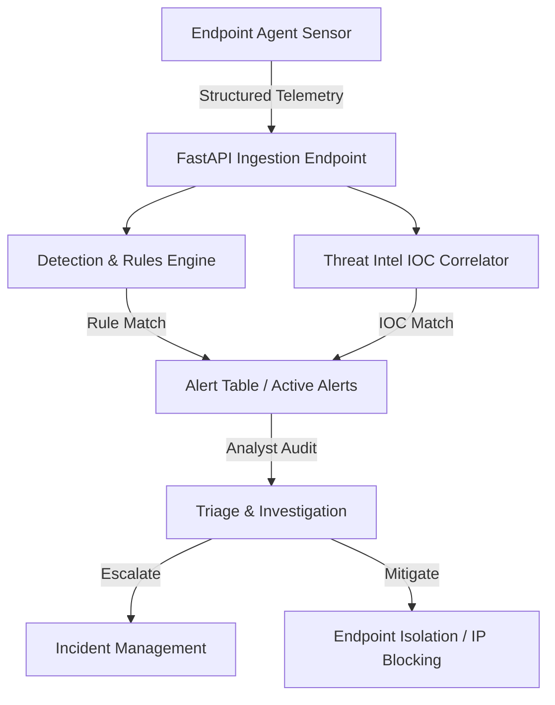

# CyberShield XDR — Extended Detection and Response / SOC Platform

CyberShield XDR is a real-world, production-ready Extended Detection and Response (XDR) and Security Operations Center (SOC) monitoring platform. It is designed to collect security event telemetry from endpoints, evaluate it against dynamic rule-based detection engines, map alerts to MITRE ATT&CK techniques, and provide incident response capabilities through an analyst-focused SOC monitoring dashboard.

Developed as a B.Tech final-year cybersecurity project, this platform moves beyond static mockups to showcase a fully functional frontend-backend-database integration suitable for SOC analyst and security engineering portfolios.

---

## 🔗 Live Demo
Experience the interactive CyberShield XDR Portal live in your browser:
👉 **[CyberShield XDR Live Portal](https://cybershield-xdr.vercel.app/)**
*(Note: Production backend requires managed PostgreSQL to persist incident triage history).*

---

## 📸 Interface Preview

### Analyst Dashboard Triage Queue
The primary dashboard provides a high-level visual overview of active threats, alert trends over time, online host counts, and top attack source IPs, alongside a filterable alert queue.

```text
[ Screenshot Placeholder: dashboard_preview.jpg - Displays the real-time threat volume charts, KPI metrics, and alert queues. ]
```

### Forensic Investigation & Incident Timeline
Analysts can drill down into any security alert to inspect raw telemetry, view MITRE ATT&CK technique details, review associated IOCs, and track the chronological incident timeline.

```text
[ Screenshot Placeholder: alert_modal.jpg - Shows the forensic drill-down panel, analyst assignment actions, and alert timeline. ]
```

---

## 🎯 Problem Statement
Modern enterprise environments generate millions of logs daily across distributed endpoints and networks. SOC analysts face constant fatigue trying to filter out background noise to find legitimate indicators of compromise (IOCs). There is a critical need for an integrated system that can:
1. Ingest telemetry from remote endpoint sensors in real-time.
2. Automatically correlate events against signature and behavioral patterns.
3. Classify and map detections to the industry-standard MITRE ATT&CK framework.
4. Facilitate structured triage, assigning ownership, and isolating compromised systems.

---

## 🚀 Key Features
- **Real-Time Telemetry Ingestion**: A robust event ingestion API endpoint capable of receiving structured event logs (process creation, network connection, logins) from lightweight sensors.
- **Dynamic Behavioral Detection Engine**: Evaluating incoming logs in sliding time windows to detect Brute Force attacks, Port Scans, Suspicious Process executions, and command bypasses.
- **MITRE ATT&CK Mapping**: Detections are automatically enriched with specific MITRE technique IDs (e.g., T1110 for Brute Force, T1046 for Network Service Scanning) to align with enterprise defense metrics.
- **Threat Intelligence Correlation**: Ingested connections are automatically correlated against an active IP/Domain/Hash IOC blocklist.
- **Audit Logging & Case Management**: Any analyst triage action (acknowledging alerts, changing statuses, escalating to incidents, or marking false positives) is documented in a immutable audit log.
- **Controlled System Isolation**: Supports safe, simulated host isolation mechanisms to lock down infected endpoints.

---

## ⚙️ XDR/SOC Analyst Workflow


1. **Telemetry Generation**: The lightweight endpoint agent collects system events and sends heartbeats.
2. **Ingestion & Correlation**: FastAPI receives the JSON payload, queries PostgreSQL, and triggers the detection pipelines.
3. **Analyst Alerting**: Detections populate the React portal's alert management queue with severity indicators.
4. **Triage & Mitigation**: The analyst investigates details, assigns ownership, elevates to an incident, or triggers host isolation.

---

## 🛠️ Technology Stack

### Frontend (User Interface)
- **Framework**: React 19 (TypeScript)
- **Build Tool**: Vite 8
- **Styling**: Tailwind CSS 3
- **Data Visualizations**: Recharts 3
- **Icons**: Lucide React

### Backend (Core Services)
- **API Framework**: FastAPI (Python 3.11+)
- **Server**: Uvicorn
- **ORM & Migrations**: SQLAlchemy 2.0 & Alembic
- **Security**: PyJWT (JSON Web Tokens), Passlib (Bcrypt password hashing)
- **Testing**: Pytest

### Database & Infrastructure
- **Database**: SQLite (Local Development) / PostgreSQL (Production)
- **Containerization**: Docker, Docker Compose

---

## 🔒 MITRE ATT&CK Integration
CyberShield XDR maps incoming detections to active threat behaviors:
* **T1110 (Credential Access / Brute Force)**: Triggered by $5+$ failed login attempts from a single source IP within 5 minutes.
* **T1046 (Discovery / Network Service Scanning)**: Triggered by connections to $10+$ distinct ports from a single IP within 2 minutes.
* **T1059 (Execution / Command and Scripting Interpreter)**: Triggered by process creations launching obfuscated shell executions or credential dumping utilities (e.g., `mimikatz.exe`).
* **T1071 (Command and Control / Standard Application Layer Protocol)**: Outbound connections matching threat intelligence feeds.

---

## 🚀 Installation & Local Setup

### Prerequisites
- Python 3.11+
- Node.js v18+
- Git

### Step 1: Clone the Repository
```bash
git clone https://github.com/nagavijayvasu/cybershield-xdr.git
cd cybershield-xdr
```

### Step 2: Backend Setup
1. Navigate to the backend directory:
   ```bash
   cd backend
   ```
2. Create and activate a virtual environment:
   ```bash
   python -m venv venv
   # On Windows:
   .\venv\Scripts\activate
   # On Linux/macOS:
   source venv/bin/activate
   ```
3. Install dependencies:
   ```bash
   pip install -r requirements.txt
   ```
4. Configure local environment variables:
   ```bash
   copy .env.example .env
   # Customize variables in .env if desired.
   ```
5. Apply database migrations to seed SQLite:
   ```bash
   alembic upgrade head
   ```

### Step 3: Frontend Setup
1. Open a new terminal and navigate to the frontend directory:
   ```bash
   cd frontend
   ```
2. Install npm dependencies:
   ```bash
   npm install
   ```

### Step 4: Run the Application
You can use the automated script in the root directory:
```powershell
# In PowerShell:
.\start.ps1
```
Alternatively, launch them manually:
- **Backend (port 8000)**: `python -m uvicorn app.main:app --reload`
- **Frontend (port 5173)**: `npm run dev`

---

## 🧪 Testing Instructions

### Run Backend Tests (Pytest)
To run the automated suite testing authentication, RBAC, rule evaluations, and dashboard metrics:
```bash
cd backend
venv\Scripts\python.exe -m pytest
```

### Simulate Endpoint Telemetry & Attacks
Run the endpoint simulator in a terminal to populate the database:
```bash
cd agent
# Activate backend venv first to run agent simulator (requires no external libraries)
..\backend\venv\Scripts\python agent.py --server http://127.0.0.1:8000
```
To trigger attack scenarios and generate alerts:
```bash
# Brute force simulation:
python agent.py --simulate brute-force
# Port scan simulation:
python agent.py --simulate port-scan
# Suspicious process execution:
python agent.py --simulate malware
# Threat intel match:
python agent.py --simulate threat-intel
```

---

## 🌍 Vercel Deployment Instructions

### Frontend Configuration
- **Root Directory**: `frontend`
- **Framework Preset**: `Vite`
- **Install Command**: `npm install`
- **Build Command**: `npm run build`
- **Output Directory**: `dist`
- **Required Env Variables**:
  - `VITE_API_BASE_URL`: The URL of your deployed backend API (e.g., `https://cybershield-xdr.vercel.app/api`).

### Backend Configuration
- The monorepo contains a `vercel.json` routing configuration that deploys the FastAPI backend as Vercel serverless python functions.
- **Required Env Variables**:
  - `DATABASE_URL`: Managed PostgreSQL connection string (starts with `postgresql://` or `postgres://`).
  - `JWT_SECRET`: Secure encryption secret (override the default local placeholder).
  - `ADMIN_USERNAME`: Seeding configuration for admin login.
  - `ADMIN_EMAIL`: Seeding configuration for admin email.
  - `ADMIN_PASSWORD`: Seeding configuration for admin password.
  - `ALLOWED_ORIGINS`: Comma-separated production domain origins to restrict CORS (e.g., `https://cybershield-xdr.vercel.app`).

---

## 🛡️ Security Notes & Production Hardening
* **JWT Secret Rotation**: The default `JWT_SECRET_KEY` in `config.py` is for local scaffolding. In production, this MUST be overridden using the `JWT_SECRET` environment variable.
* **Database Credentials**: SQLite is excluded from Git commits. Production PostgreSQL connection strings are read strictly via environment variables.
* **CORS Restrictions**: CORS allow-origins are dynamically parsed from `ALLOWED_ORIGINS` to prevent unauthorized cross-origin requests.
* **Server-Side Authorization**: API routes check roles server-side using FastAPI dependencies (`require_admin`, `RoleChecker`), ensuring the UI's dashboard view changes are mirrored by absolute backend restrictions.

---

## 🔮 Future Enhancements
- **Agent encryption**: Implement TLS encryption for telemetry packets sent from endpoint agents.
- **Agent authentication**: Enforce X-API-Key verification for telemetry ingestion routes.
- **STIX/TAXII integrations**: Synchronize live threat feeds to dynamically update database IOC collections.

---

## 📝 License & Contact
- **Author**: Vijay Vasu (nagavijayvasu@gmail.com)
- **License**: MIT License
